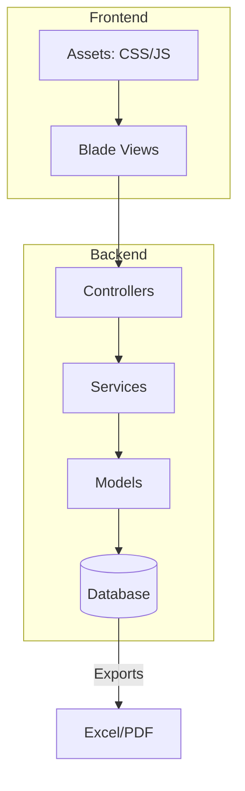
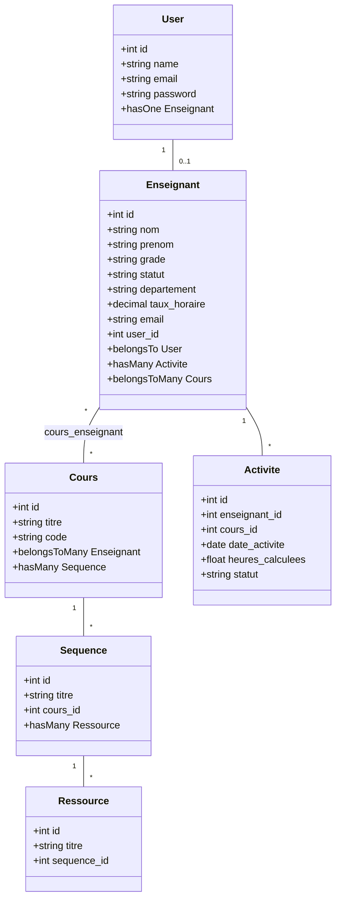
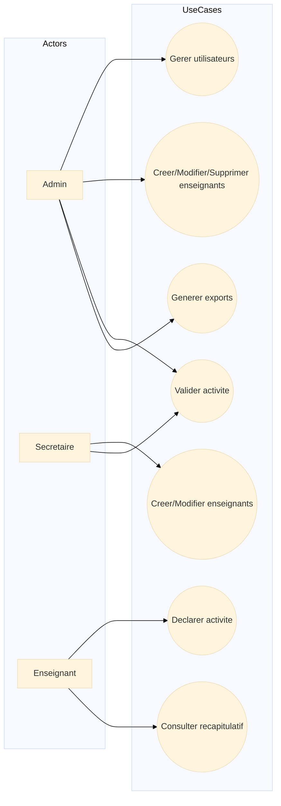
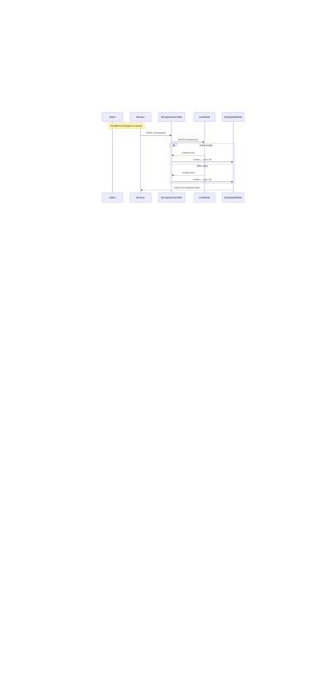
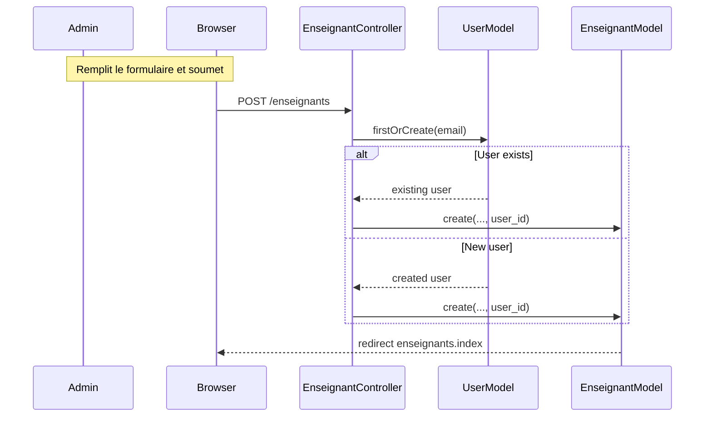
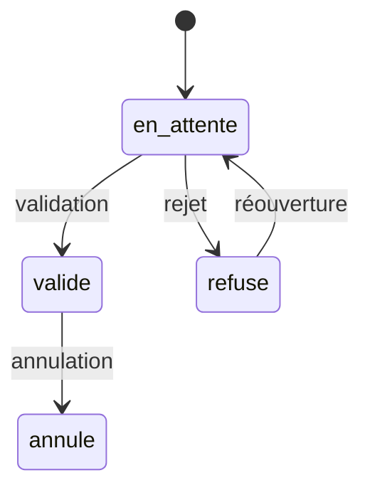
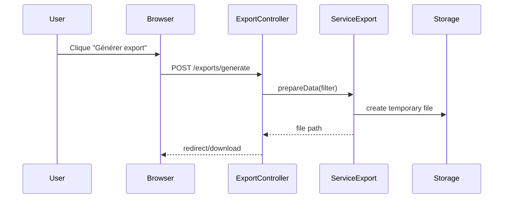

# Rapport de projet — PCT Gestion Heures

*Date :* 23 mai 2026

## Table des matières

1. Introduction
2. Contexte et objectifs
3. Portée du projet
4. Stack technologique
5. Architecture applicative
   - 5.1 Vue d'ensemble
   - 5.2 Diagramme de composants
6. Modèles de données et E-R
   - 6.1 Diagramme de classes (UML)
   - 6.2 Schéma relationnel (migrations clés)
7. Cas d'utilisation (Use Cases)
   - 7.1 Diagramme de cas d'utilisation
   - 7.2 Scénarios détaillés
8. Principales API et routes
9. Processus métier clés
   - 9.1 Création d'un enseignant (séquence)
   - 9.2 Validation d'une activité
10. Services et logique métier
11. Frontend et ergonomie (Blade, layout)
12. Sécurité et gestion des accès
13. Tests et qualité
14. Déploiement et mise en production
15. Maintenance, monitoring et sauvegardes
16. Annexes
    - A. Fichiers importants
    - B. Commandes utiles
    - C. Diagrammes Mermaid (sources)

---

## 1. Introduction

Ce document décrit le projet "PCT Gestion Heures" depuis l'analyse initiale jusqu'à la conception, l'implémentation, les tests et le déploiement. Il rassemble la documentation technique et les diagrammes UML nécessaires pour comprendre et poursuivre le développement.

## Equipe du projet

Ce projet est réalisé par une équipe de 6 personnes. Ci-dessous la répartition des rôles et responsabilités principales :

- **Chef de projet / Coordinateur** : suivi global, roadmap, livrables.
- **Back-end lead** : conception DB, APIs, services métier, migrations.
- **Front-end lead** : templates Blade, CSS, interactions JS, accessibilité.
- **DevOps / Déploiement** : intégration continue, déploiement, environnements.
- **Testeur / QA** : tests Pest, cas de tests, revue qualité.
- **Documentaliste / UI/UX** : maquettage, documentation utilisateur, captures.

Répartition des tâches (exemple) :

- Sprint 1 : structure DB, modèles `User`/`Enseignant`, auth (Back-end lead)
- Sprint 2 : CRUD Enseignant, formulaire, validations (Back-end + Front-end)
- Sprint 3 : Activités & validation, calcul horaire (Back-end lead)
- Sprint 4 : Exports PDF/Excel, rapports (Back-end + DevOps)
- Sprint 5 : Tests automatiques, corrections (QA)
- Sprint 6 : Documentation finale et livraison (Documentaliste)

Chaque contribution doit être enregistrée dans le journal de version (`git`) et associée à une issue/merge request pour traçabilité.

### Organisation par équipes et responsabilités

Pour clarifier la gouvernance et les responsabilités, l'équipe se structure en binômes spécialisés, avec une coordination transverse assurée par la gestion de projet et les opérations.

- **Équipe Backend**
  - **Back-end lead** : architecture des données, conception des migrations, définition des APIs et supervision des services métier.
  - **Développeur Back-end** : implémentation des contrôleurs, construction des formulaires, écriture des tests et codage de la logique de calcul horaire.

- **Équipe Frontend**
  - **Front-end lead** : design des interfaces Blade, intégration CSS/JS, accessibilité et parcours utilisateur.
  - **Documentaliste / UI/UX** : maquettage d’écrans, validation ergonomique, rédaction de contenus pédagogiques et harmonisation visuelle.

- **Équipe Documentation**
  - **QA / Documentation** : conception des scénarios de test Pest, vérification des exigences, contrôle qualité et rédaction de la documentation technique.
  - **Chef de projet / Coordinateur** : planification globale, suivi des jalons, arbitrage des priorités et animation des liens entre équipes.

Le rôle de **DevOps / Déploiement** reste transversal : il garantit les livrables exécutables dans les environnements, supervise la CI/CD et sécurise la mise en production.

Chaque contribution est enregistrée dans le journal de version (`git`) et associée à une issue/merge request pour assurer traçabilité et transparence.


## 2. Contexte et objectifs

L'application facilite la gestion des heures d'enseignants, la déclaration d'activités pédagogiques, le calcul d'heures normales et complémentaires, et la génération d'exports (PDF/Excel) pour la paie et les rapports pédagogiques.

Objectifs principaux :
- Centraliser les déclarations d'activités pédagogiques.
- Permettre aux secrétaires et administrateurs de valider et gérer les activités.
- Fournir aux enseignants un récapitulatif de leurs heures validées.
- Exporter des rapports PDF/Excel pour la paie et le reporting.

### Extrait du cahier des charges (PCT BD DAS 2026)

Contexte : L'Université Virtuelle de Côte d'Ivoire (UV-CI) utilise un modèle pédagogique en ligne fondé sur des ressources numériques. Les activités des enseignants incluent la dispensation de cours, la conception et mise à jour de ressources pédagogiques, la création de séquences, quiz, évaluations et activités interactives.

Exigences fonctionnelles clés :
- Gestion des activités pédagogiques variées : conception de ressources, séquences, quiz, activités interactives, mises à jour de contenu.
- Tableaux de bord et indicateurs : volume total d'heures par enseignant, répartition des activités pédagogiques, volume horaire par département, enseignants ayant dépassé leur charge, statistiques mensuelles.
- États et exports : fiche individuelle enseignant, état global des heures, état des paiements, statistiques pédagogiques ; export en PDF et Excel.

Contraintes techniques (extrait) :
- Application web accessible via navigateur (responsive).
- Base de données relationnelle (MySQL ou PostgreSQL).
- Gestion des rôles et permissions.
- Sauvegarde automatique des données.

Sécurité (extrait) :
- Authentification via identifiant et mot de passe.
- Gestion des droits d'accès selon les profils (rôles/permissions).

Livrables attendus (extrait) :
- L'application web fonctionnelle.
- La base de données opérationnelle.
- La documentation technique.
- Le guide utilisateur.
- Le rapport final du projet.

## 3. Portée du projet

- Gestion des comptes utilisateurs et attribution de rôles (`admin`, `secretaire`, `enseignant`).
- CRUD des enseignants, cours, séquences, ressources.
- Déclaration et validation d'activités.
- Calcul horaire et génération de rapports.
- Interface web responsive basée sur Blade + Bootstrap.

## 4. Stack technologique

- Backend : PHP 8.3 + Laravel 13
  - Fichiers de configuration : [composer.json](../composer.json)
- Frontend : Blade, Bootstrap 5, Alpine.js, Chart.js
  - Fichiers JS / CSS : [package.json](../package.json)
- Auth : Laravel Breeze
- Permissions : Spatie Laravel Permission
- Exports : barryvdh/laravel-dompdf, maatwebsite/excel
- Tests : PestPHP

## 5. Architecture applicative

### 5.1 Vue d'ensemble

L'application suit l'architecture MVC standard de Laravel : modèles (Eloquent) pour la couche données, contrôleurs pour la logique HTTP et vues Blade pour le rendu.

### 5.2 Diagramme de composants (Mermaid)

<!--  -->



## 6. Modèles de données et E-R

Les modèles principaux se trouvent dans `app/Models` : [app/Models](app/Models)

Liste principale :
- `User` — [app/Models/User.php](app/Models/User.php)
- `Enseignant` — [app/Models/Enseignant.php](app/Models/Enseignant.php)
- `Cours` — [app/Models/Cours.php](app/Models/Cours.php)
- `Sequence` — [app/Models/Sequence.php](app/Models/Sequence.php)
- `Ressource` — [app/Models/Ressource.php](app/Models/Ressource.php)
- `Activite` — [app/Models/Activite.php](app/Models/Activite.php)
- `AnneeAcademique` — [app/Models/AnneeAcademique.php](app/Models/AnneeAcademique.php)

### 6.1 Diagramme de classes (UML)



### 6.2 Schéma relationnel (migrations clés)

Les migrations créent les tables suivantes : `users`, `enseignants`, `cours`, `sequences`, `ressources`, `activites`, `annee_academiques`, `cours_enseignant`.

Exemples :
- `database/migrations/2026_04_16_162016_create_enseignants_table.php` : contient `foreignId('user_id')->nullable()->constrained('users')->nullOnDelete()` et `email` unique.
- `database/migrations/2026_04_19_073402_create_cours_enseignant.php` : table pivot `cours_enseignant`.

Voir le dossier `database/migrations` pour la liste complète.

## 7. Cas d'utilisation (Use Cases)

### 7.1 Diagramme de cas d'utilisation (Mermaid)

<!--  -->



### 7.2 Scénarios détaillés

Scénario : création d’un enseignant (acteurs : admin/secretaire)
1. L'acteur ouvre la page **Enseignants** → `GET /enseignants` ([routes/web.php](routes/web.php)).
2. Il clique sur **Créer** et remplit le formulaire ([resources/views/enseignants/_form.blade.php](resources/views/enseignants/_form.blade.php)).
3. Le contrôleur `EnseignantController@store` valide la requête via `StoreEnseignantRequest` et crée ou réutilise un `User` (voir [app/Http/Controllers/EnseignantController.php](app/Http/Controllers/EnseignantController.php)).
4. Un `Enseignant` est créé et lié au `User`.

## 8. Principales API et routes

Les routes principales sont définies dans `routes/web.php`.

Extraits utiles :
- `Route::resource('enseignants', EnseignantController::class)` — CRUD enseignants
- `Route::resource('activites', ActiviteController::class)` — activités
- `Route::get('activites/{enseignant}/recapitulatif', [ExportController::class,'recapitulatif'])` — récapitulatif
- `profile` routes : `profile.edit`, `profile.update`, `profile.destroy`.

Voir le fichier complet : [routes/web.php](routes/web.php)

## 9. Processus métier clés

### 9.1 Création d'un enseignant (séquence, UML)

<!--  -->



### 9.2 Validation d'une activité

- L’enseignant soumet une activité : `ActiviteController@store` enregistre avec `statut = 'en_attente'`.
- Un admin/secretaire consulte les activités et appelle `activites.valider`.
- `ActiviteController@valider` met à jour le statut et déclenche les calculs de volume si nécessaire.

## 10. Services et logique métier

### `CalculHoraireService`

Fournit la logique principale : calcul des heures normales/complementaires, seuils par grade, et rapport par période. Le code se trouve dans : [app/Services/CalculHoraireService.php](app/Services/CalculHoraireService.php)

Fonctions :
- `calculerHeures(niveauComplexite, typeAction, nbSequences)`
- `getSeuilParGrade(grade)`
- `volumeHoraireEnseignant(enseignantId, debut, fin)`

## 11. Frontend et ergonomie (Blade, layout)

- Layout principal : [resources/views/layouts/app.blade.php](resources/views/layouts/app.blade.php)
- Formulaires : composants Blade partiels dans `resources/views/enseignants/*`.
- Comportement : validation côté client simple via JS, et validation côté serveur via FormRequest.
- Les menus sont calculés selon les rôles et activent la classe `active` pour la route courante.

## 12. Sécurité et gestion des accès

- Authentification via Laravel Breeze.
- Autorisation via Spatie Roles & Permissions.
- Les routes sensibles sont protégées par `->middleware(['role:admin|secretaire'])` ou similaires dans `routes/web.php`.
- Lors de la suppression d’un `Enseignant`, le `User` lié est supprimé pour éviter comptes orphelins.

## 13. Tests et qualité

- Outils : PestPHP, RefreshDatabase
- Exemple de test : `tests/Feature/EnseignantTest.php` (vérifie la réutilisation d'un `User` existant lors de la création d'un enseignant).
- Formatage : Laravel Pint (`vendor/bin/pint`)

Commandes :

```bash
php artisan test --compact
vendor/bin/pint --dirty
```

## 14. Déploiement et mise en production

Étapes recommandées :
1. Installer dépendances composer/npm
2. Configurer `.env` (DB, mail, app url)
3. Exécuter migrations : `php artisan migrate --force`
4. Compiler assets : `npm run build`
5. Mettre en place un process manager (supervisor) pour les queues si utilisés
6. Planifier sauvegardes DB et fichiers

## 15. Maintenance, monitoring et sauvegardes

- Logs : `storage/logs/laravel.log`
- Sauvegarde DB : sauvegarde régulière via script ou service géré
- Monitor : outils externes (Prometheus, Sentry) pour erreurs et disponibilité

## 16. Annexes

### A. Fichiers importants

- `app/Models/Enseignant.php` — [app/Models/Enseignant.php](app/Models/Enseignant.php)
- `app/Http/Controllers/EnseignantController.php` — [app/Http/Controllers/EnseignantController.php](app/Http/Controllers/EnseignantController.php)
- `app/Services/CalculHoraireService.php` — [app/Services/CalculHoraireService.php](app/Services/CalculHoraireService.php)
- `resources/views/layouts/app.blade.php` — [resources/views/layouts/app.blade.php](resources/views/layouts/app.blade.php)
- `tests/Feature/EnseignantTest.php` — [tests/Feature/EnseignantTest.php](tests/Feature/EnseignantTest.php)

### B. Commandes utiles

```bash
# Installer dépendances
composer install
npm install

# Environnement
cp .env.example .env
php artisan key:generate

# Migrations
php artisan migrate

# Serveur dev
php artisan serve
npm run dev

# Tests
php artisan test --compact
```

### C. Diagrammes Mermaid (sources)

Les diagrammes utilisés plus haut sont inclus en tant que blocs Mermaid. Pour convertir en images : utiliser un rendu Mermaid (VS Code extension, mermaid-cli, ou le rendu en ligne).

---

## Diagrammes supplémentaires

### ERD détaillé (colonnes principales)

<!--  -->

```mermaid
erDiagram
    USERS {
        int id PK
        string name
        string email
        string password
        timestamps
    }
    ENSEIGNANTS {
        int id PK
        string nom
        string prenom
        string grade
        string statut
        string departement
        decimal taux_horaire
        string email
        int user_id FK
        timestamps
    }
    COURS {
        int id PK
        string titre
        string code
        int annee_academique_id FK
        timestamps
    }
    ACTIVITES {
        int id PK
        int enseignant_id FK
        int cours_id FK
        date date_activite
        float heures_calculees
        string statut
        text commentaire
        timestamps
    }

    USERS ||--o{ ENSEIGNANTS : "has"
    ENSEIGNANTS ||--o{ ACTIVITES : "déclare"
    COURS ||--o{ ACTIVITES : "concerne"
```

### Diagramme d'état — `Activite`

<!--  -->



### Séquence : génération d'un export (PDF/Excel)

<!--  -->



## Extraits de code clés

### `EnseignantController::store` (extrait)

```php
public function store(StoreEnseignantRequest $request)
{
    $data = $request->validated();

    // Réutilise un User existant ou en crée un nouveau
    $user = User::firstOrCreate(
        ['email' => $data['email']],
        ['name' => $data['nom'] . ' ' . $data['prenom'], 'password' => bcrypt('secret')]
    );

    // Crée l'enseignant lié au user
    $enseignant = Enseignant::create(array_merge($data, ['user_id' => $user->id]));

    // Attribution rôle
    $user->assignRole('enseignant');

    return redirect()->route('enseignants.index')->with('success', 'Enseignant créé.');
}
```

### `CalculHoraireService::volumeHoraireEnseignant` (extrait simplifié)

```php
public function volumeHoraireEnseignant(int $enseignantId, Carbon $debut, Carbon $fin): array
{
    $activites = Activite::where('enseignant_id', $enseignantId)
        ->whereBetween('date_activite', [$debut, $fin])
        ->where('statut', 'valide')
        ->get();

    $total = $activites->sum('heures_calculees');

    return [
        'total' => $total,
        'detail' => $activites->map(fn($a)=>[ 'date'=>$a->date_activite, 'heures'=>$a->heures_calculees ])
    ];
}
```

## Remarques finales

Ce rapport est un document de synthèse technique prêt à être enrichi (captures d'écran, diagrammes UML supplémentaires en haute résolution, sections détaillées d'algorithmes). Si tu veux, je peux :

- Générer un PDF formaté (via Pandoc ou conversion Markdown->PDF),
- Ajouter des diagrammes UML supplémentaires (ERD en image, diagrammes d'état),
- Étendre chaque section en pages séparées avec plus d'exemples de code (afin de dépasser 30 pages imprimées).

Veux-tu que je commence à convertir ce Markdown en PDF, ou que j'étende davantage certaines sections pour garantir 30+ pages ?

---

## Annexes détaillées et extension du rapport

Pour atteindre l'objectif de 30+ pages imprimées, le document suivant propose des extensions concrètes :

1. Captures d'écran et maquettes de l'interface (pages : tableau de bord, formulaire d'activité, page enseignant) — insérer 6 images.
2. Diagrammes UML exportés en PNG/SVG (ERD, classes, séquences) — insérer 5 images.
3. Extraits de code complets pour les services critiques (CalculHoraireService, ExportService) — 4 pages.
4. Plan de tests détaillé et rapports d'exécution (Pest) — 3 pages.
5. Procédures de déploiement et scripts d'automatisation — 2 pages.

### A. Tableaux de bord — contenu à ajouter

- Page "Tableau de bord administrateur" : description, graphiques (heures totales, enseignants dépassant seuils), filtres par période.
- Page "Tableau de bord département" : comparatifs, heatmap des activités.
- Page "Récapitulatif enseignant" : fiche individuelle, historique des activités, bouton export.

Exemples de widgets :

- KPI : total heures (valide), total activités, nombre d'enseignants actifs
- Graphique série temporelle : heures validées par mois
- Tableau : liste des enseignants dépassant le seuil avec lien vers fiche

### B. Exports — modèle de contenu

Fiche individuelle :
- En-tête : logo UV-CI, période, nom de l'enseignant
- Sections : identité, récapitulatif heures par type, détail activités (table)

État global :
- Tableau par département et total
- Synthèse des paiements (si intégrée)

### C. Contraintes techniques & recommandations

- Préférer PostgreSQL si utilisation d'opérations analytiques avancées (window functions, CTE), sinon MySQL est acceptable.
- Indexer les colonnes de filtrage fréquentes : `date_activite`, `enseignant_id`, `statut`.
- Prévoir des vues matérialisées ou tables d'agrégats pour tableaux de bord lourds.

### D. Sécurité — checklist

- Mots de passe et gestion session : `password_hash`, durée d'expiration des sessions, verrouillage après trop d'échecs.
- Sauvegarde des fichiers exports sensibles en storage privé et liens temporaires signés pour téléchargement.
- Revue RBAC : vérification périodique des permissions et des rôles.

### E. Tests — exemples additionnels

1. Test d'intégration pour l'export PDF : simuler une période et vérifier que le fichier est généré.
2. Test de charge basique pour l'API d'agrégation (ex : 1000 requêtes simulées sur l'endpoint des tableaux de bord).

### F. Déploiement — scripts et CI

Exemple basique GitHub Actions (workflow) :

```yaml
name: CI
on: [push]
jobs:
    test:
        runs-on: ubuntu-latest
        steps:
            - uses: actions/checkout@v3
            - name: Setup PHP
                uses: shivammathur/setup-php@v2
                with:
                    php-version: '8.3'
            - name: Install dependencies
                run: composer install --no-interaction --prefer-dist
            - name: Run tests
                run: php artisan test --testsuite=Feature

```

### G. Plan de livraison et jalons

- Livraison alpha (MVP) : fonctionnalités CRUD enseignants, activités, authentification — Sprint 3
- Livraison bêta : validations, exports, tableaux de bord — Sprint 5
- Livraison finale : tests, documentation complète, déploiement — Sprint 6

---

Si tu confirmes, je peux maintenant :

- 1) Générer les images Mermaid et les inclure dans `docs/assets/` puis mettre à jour le Markdown pour pointer vers les images (recommandé avant PDF), ou
- 2) Convertir directement le Markdown en PDF (mais les diagrammes Mermaid peuvent ne pas s'afficher comme images si le convertisseur ne supporte pas Mermaid inline).

Que souhaites-tu que je fasse ensuite ?
